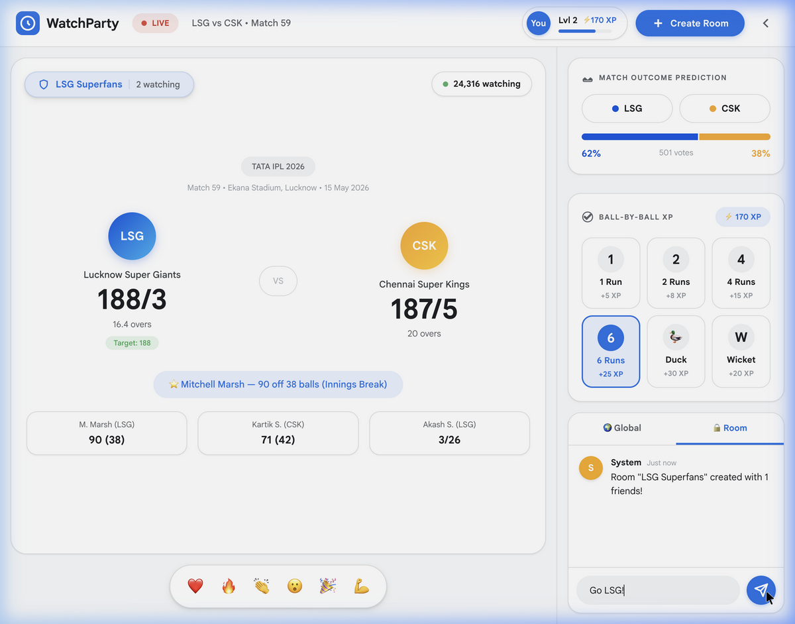
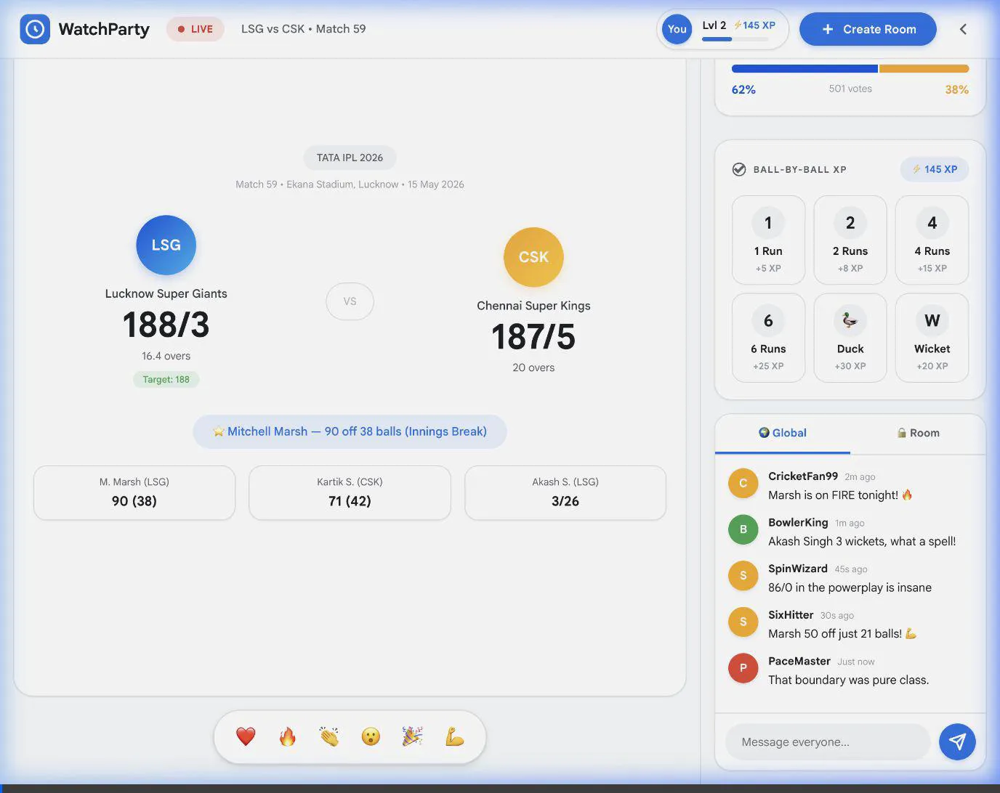

# 🏏 IPL Fan Hub

A real-time IPL cricket watch-party web app built for the HashedIn competition. Fans can follow the match live, engage with interactive cricket visualizations, predict outcomes, chat with other fans, and compete for XP — all in one immersive experience.

Themed with **Google's Material Design** color system and design language throughout.

---

## Features

### Live Match Experience
- **Live Scoreboard** — ball-by-ball score, wickets, run rate, and partnership tracker
- **Pressure Meter** — animated gauge showing match pressure that spikes and decays in real time
- **Momentum System** — fan cheer button that builds a wave animation when the crowd hits 100%

### Interactive Cricket Visualizations
- **Boundary Wagon Wheel** — SVG field map; tap a sector to predict the next boundary direction, shot lines animate after your vote
- **Pitch Pressure Zone** — vertical pitch SVG with 5 zones (Short → Yorker); vote where the next wicket-taking ball will land, ball mark animates on selection
- **Live Fan Presence (Stadium Heatmap)** — top-down stadium SVG with 8 stand sections that light up in real time as fan energy spikes and decays
- **Fan Power Battle (Rivalry Meter)** — animated arc gauge showing LSG vs CSK fan power with a glowing split marker that slides as scores shift

### Fan Engagement
- **Quiz System** — timed in-match trivia with XP rewards and a countdown timer
- **Reaction System** — quick emoji reactions (🔥 💥 🙌 😱) visible to all fans
- **Social Chat** — global and private room chat panels with live fan messages

---

## Tech Stack

| Layer | Tech |
|---|---|
| Framework | React 19 |
| Build tool | Vite 8 |
| Styling | Inline styles + CSS keyframes |
| Visualizations | Hand-crafted SVG with arc math |
| Design system | Google Material Design / Google Sans |
| Linting | ESLint |

---

## Color Palette (Google Brand)

| Color | Hex | Usage |
|---|---|---|
| Google Blue | `#4285F4` | LSG fans, primary accent, WagonWheel sectors |
| Google Red | `#EA4335` | Alerts, LIVE badge, high-hype indicator |
| Google Yellow | `#FBBC05` | CSK fans, sixes, pitch zone |
| Google Green | `#34A853` | Field, Good Length zone |
| Surface | `#F8F9FA` | Card backgrounds |
| Border | `#DADCE0` | All card borders |
| Text Primary | `#202124` | Main body text |
| Text Secondary | `#5F6368` | Labels, subtitles |

---

## Getting Started

```bash
# Install dependencies
npm install

# Start dev server
npm run dev

# Build for production
npm run build
```

---

## Project Structure

```
src/
├── App.jsx                  # Root layout, mock data, state management
├── index.css                # Global styles and keyframe animations
└── components/
    ├── Scoreboard.jsx        # Live match score display
    ├── PressureMeter.jsx     # Animated pressure gauge
    ├── MomentumSystem.jsx    # Cheer button + wave animation
    ├── WagonWheel.jsx        # SVG boundary prediction wheel
    ├── PitchMap.jsx          # SVG pitch zone voting map
    ├── StadiumHeatmap.jsx    # Top-down stadium fan presence map
    ├── RivalryMeter.jsx      # LSG vs CSK arc fan power gauge
    ├── QuizSystem.jsx        # Timed trivia with XP
    ├── ReactionSystem.jsx    # Emoji fan reactions
    ├── SocialPanel.jsx       # Global + room chat
    ├── EngagementHub.jsx     # XP and engagement tracker
    └── Modals.jsx            # Room creation modal
```

---

## Live Demo

**[https://ipl-fan-hub-371287462993.asia-south1.run.app](https://ipl-fan-hub-371287462993.asia-south1.run.app)**

Deployed on **Google Cloud Run** (Mumbai — `asia-south1`), served via nginx on a containerised Vite production build. Scales to zero when idle.

---

## Built By

**Nitoos** — For APL, 2026

---

## Verification Results

The application has been verified with the following results:
- ✅ **Scoreboard**: Correctly displays match data and looks premium.
- ✅ **Reactions**: Emoji bursts pop up and animate as expected.
- ✅ **Voting**: Percentage bars update smoothly upon casting a vote.
- ✅ **XP System**: XP increases correctly when making predictions (e.g., +25 XP for a 6).
- ✅ **Room Creation**: Modals work perfectly, allowing room naming and friend selection.
- ✅ **Chat**: Messages are sent and displayed instantly in the correct channel.
- ✅ **Boundary Wagon Wheel**: Interactive sectors log predictions, and visual state updates correctly.
- ✅ **Pitch Pressure Zone**: Interactive grid highlights fan predictions in real-time.
- ✅ **Live Fan Presence**: Stadium heatmap redesigned to SVG vector graphics with better glow and team-based visualizations.

---

## Visual Documentation



### Video Walkthrough
The full interaction flow was recorded during verification:

